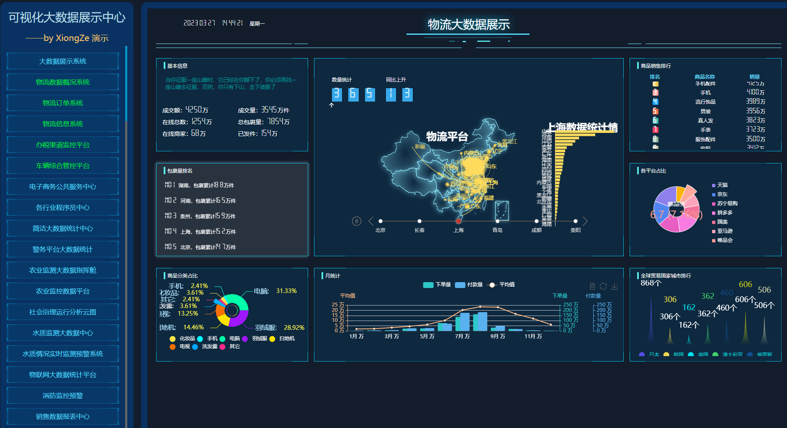

# 持续更新中（75+24套）：数据可视化集合。 

#### 介绍
基于HTML/CSS/Echarts的会议展览、业务监控、风险预警、数据分析展示等多种展示需求可视化集合。

 **2021-11-24** ：新增75套数据可视化源码

 **2021-11-22** ：24套数据可视化源码

演示地址：
 **[https://www.xiongze.net/viewdata/index.html](https://www.xiongze.net/viewdata/index.html)** 

#### 应用方式
使用[smartchart](https://gitee.com/smartchart/smartchart)进行模板转化

